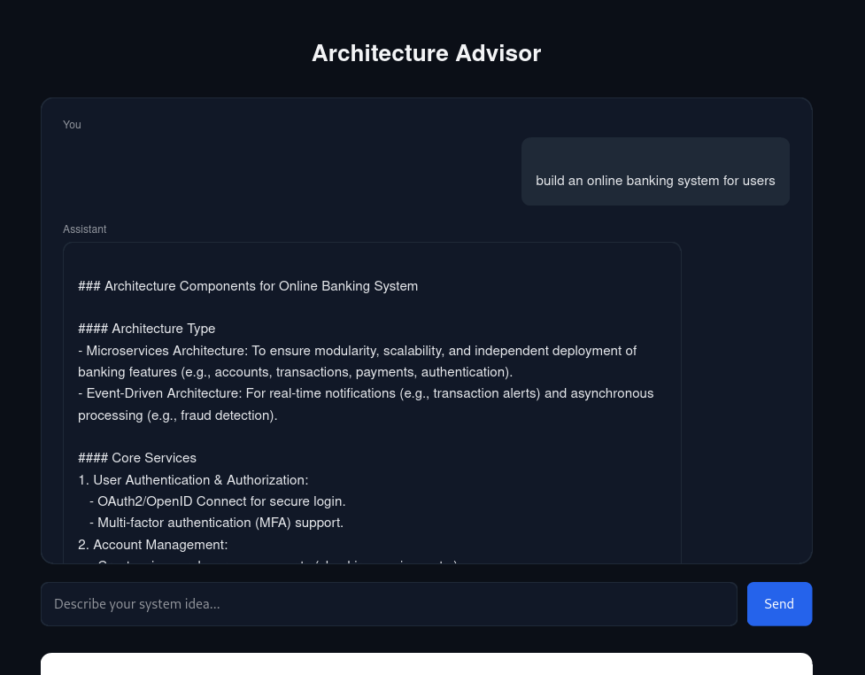
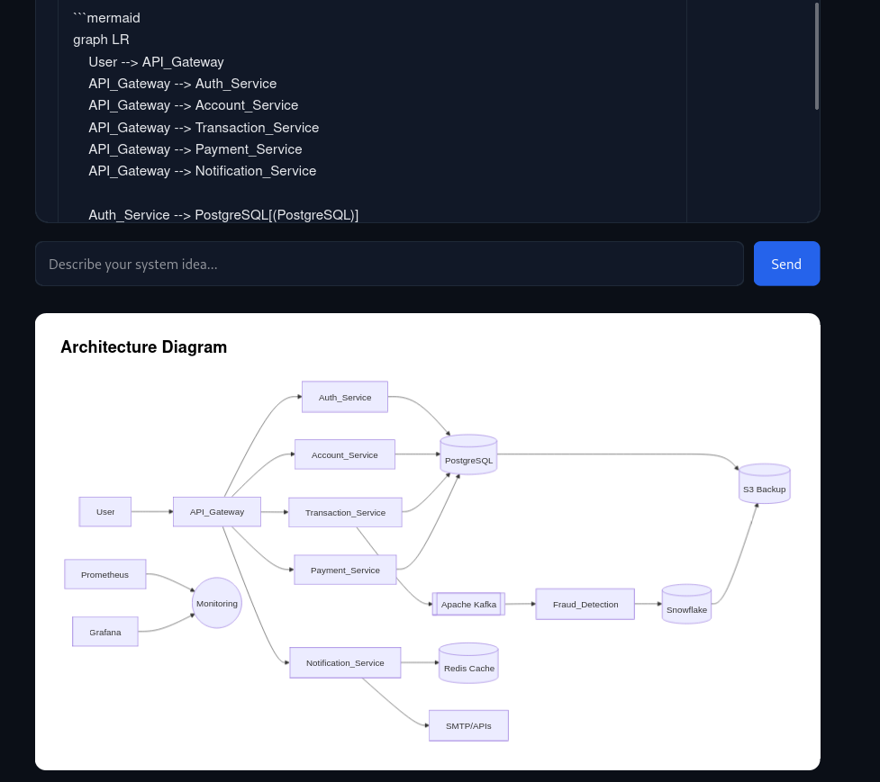

# Architecture Advisor

Architecture Advisor is an AI-assisted tool that helps developers design system architectures for software products. A user describes their application idea and the system generates a recommended architecture along with an explanation and a visual diagram.

The project combines rule-based architecture decisions with large language model reasoning to produce structured architecture guidance and diagrams.

---
## system design generation 


## visual diagram for faster understanding along with mermaid diagram


## Overview

Designing scalable systems requires decisions about infrastructure, services, databases, messaging systems, and deployment architecture. Architecture Advisor assists with this process by analyzing user requirements and suggesting a possible system architecture.

The system performs three main tasks:

1. Accepts a natural language description of a system idea.
2. Uses an AI model to analyze requirements and propose an architecture.
3. Generates a visual architecture diagram using Mermaid.

The tool is intended as a learning and prototyping assistant rather than a strict architecture generator.

---

## Features

- Natural language system design input
- AI-generated architecture recommendations
- Automatic Mermaid architecture diagram generation
- Conversation memory for iterative refinement
- Simple web interface
- FastAPI backend
- Modular architecture decision engine

---

## Example

User input:
Build a food delivery platform for 50k users with real-time tracking and payments


Example output:

- API Gateway
- Authentication service
- Order service
- Real-time location service
- Payment service
- PostgreSQL database
- Redis cache
- Message queue

Generated Mermaid diagram:
User -> API Gateway -> Services -> Database


---

## Project Structure
architecture-advisor/
│
├── main.py
├── llm.py
├── decision_engine.py
├── memory.py
├── state.py
│
├── templates/
│ └── index.html
│
└── README.md

Description of key components:

### main.py
Entry point of the FastAPI server. Handles routing, request processing, and template rendering.

### llm.py
Handles communication with the language model. Sends conversation history and retrieves responses.

### decision_engine.py
Contains rule-based logic for architecture suggestions based on parameters such as user count, real-time requirements, and payment integration.

### memory.py
Stores conversation history for maintaining context between interactions.

### state.py
Stores user-provided system parameters that influence architecture decisions.

### templates/index.html
Frontend interface built with HTML, CSS, and JavaScript. Displays chat responses and Mermaid diagrams.

---

## Tech Stack

Backend
- Python
- FastAPI
- Jinja2

AI
- LLM API (via OpenRouter or similar)

Frontend
- HTML
- CSS
- JavaScript

Visualization
- Mermaid.js

---

## Installation

Clone the repository:
```
git clone https://github.com/Pixeler5diti/architecture-advisor.git

cd architecture-advisor
```

Create a virtual environment:
```
python -m venv venv
source venv/bin/activate
```

Install dependencies:
```
pip install -r requirements.txt
```

---

## Running the Application

Start the server:
```
uvicorn main:app --reload
```

Open the application in a browser:
http://127.0.0.1:8000


You can now describe a system idea and receive an architecture suggestion.

---

## Mermaid Diagram Generation

The system extracts Mermaid code blocks from the model output using a regular expression:

